# 🌱 GrowEasy Frontend

> **Experience productivity with a premium, glassmorphic design.**

GrowEasy is a modern, aesthetically pleasing Todo application built with **React Native** and **Expo**. It combines powerful task management features with a beautiful, fluid user interface.

---

## 🎥 Demo

See GrowEasy in action:

<video src="./screenshots/demo_video.mp4" controls width="100%"></video>

*[Click here to watch the demo video directly](./screenshots/demo_video.mp4)*

---

## ✨ Features

### 🔐 Authentication
Secure and seamless entry to your workspace.
- **Login & Signup**: Clean, intuitive forms with validation.
- **Security**: JWT-based authentication with secure token storage.

| Login | Signup |
|:---:|:---:|
| 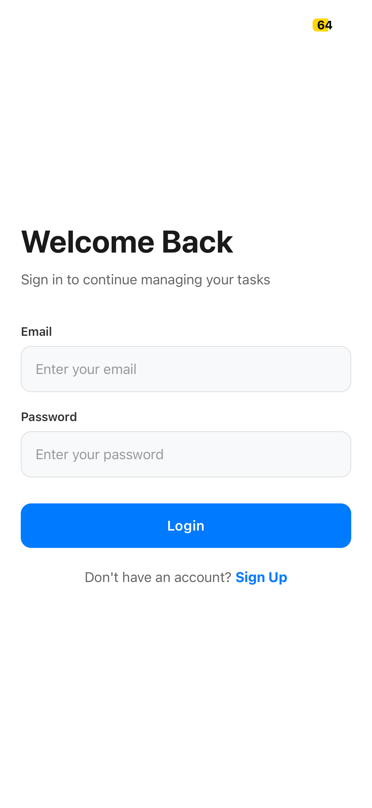 | 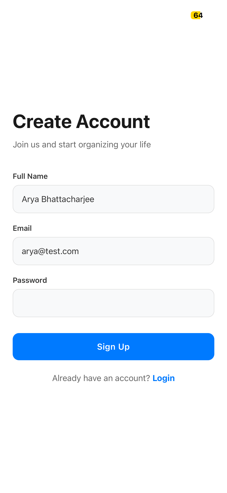 |

### 🌗 Dynamic Theming
Work in the environment that suits you best.
- **Light & Dark Modes**: Fully supported themes that adapt to your preference.
- **Glassmorphism**: Premium visual effects for a modern feel.

| Light Mode | Dark Mode |
|:---:|:---:|
| 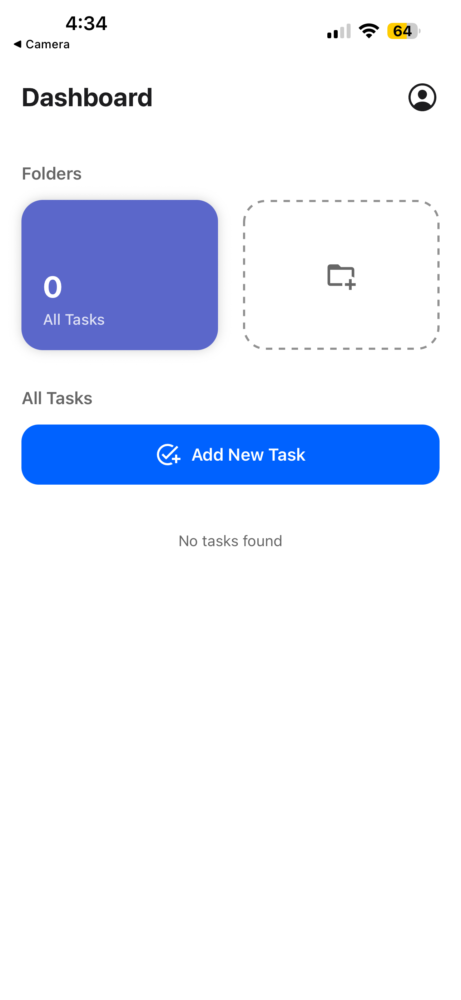 | 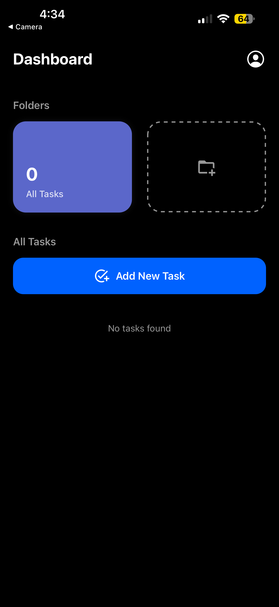 |

### 📝 Powerful Task Management
Stay on top of your goals with ease.
- **Create Tasks**: Quickly add new todos.
- **Subtasks**: Break complex tasks into manageable steps.
- **Smart Completion**: Automatically completes the parent task when all subtasks are done.
- **Visual Feedback**: Satisfying animations and haptics when completing tasks.

| Adding Task | Subtasks | Task Complete |
|:---:|:---:|:---:|
| 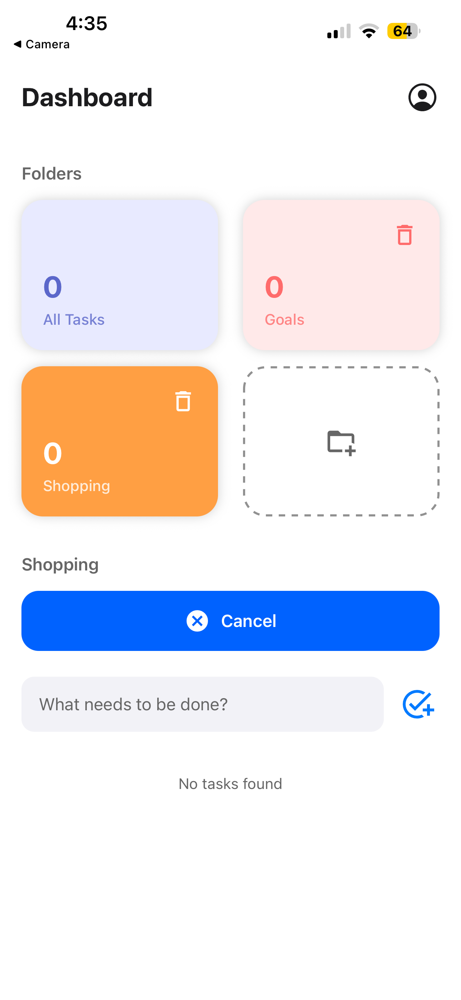 | 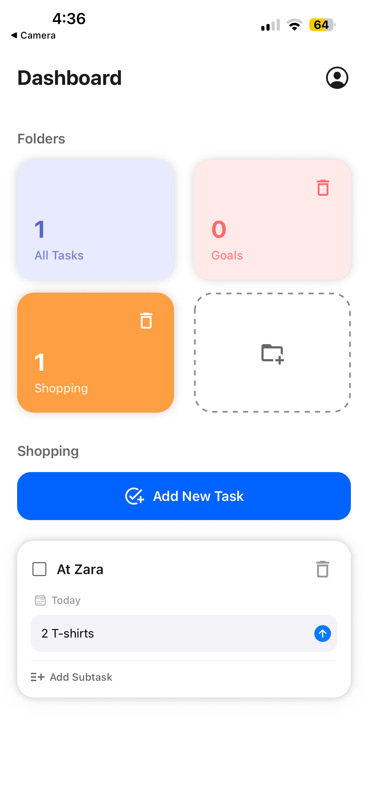 | 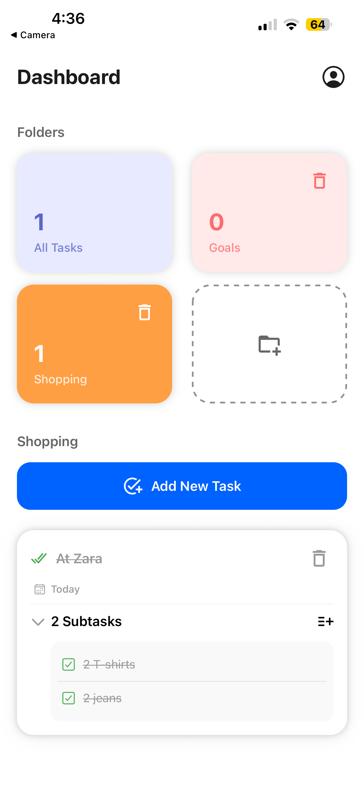 |

### 📂 Organization
Keep your life sorted.
- **Folders**: Group related tasks into custom folders.
- **Dashboard View**: Get a high-level overview of your progress.

| Dashboard View | Adding Folder |
|:---:|:---:|
| 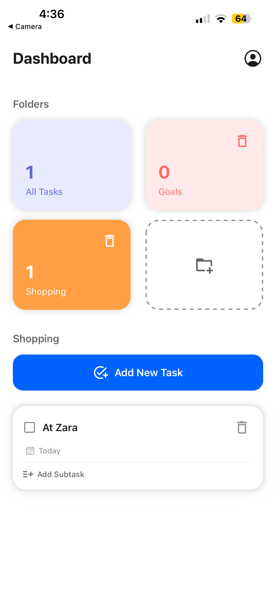 | 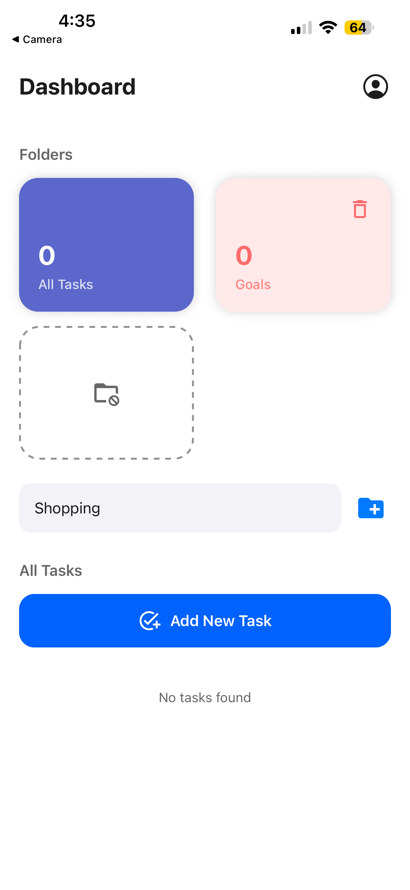 |

### 👤 Profile & Settings
Manage your account and preferences.
- **Profile Customization**: View your details.
- **Theme Toggle**: Switch between light and dark modes instantly.

| Profile (Light) | Profile (Dark) |
|:---:|:---:|
| 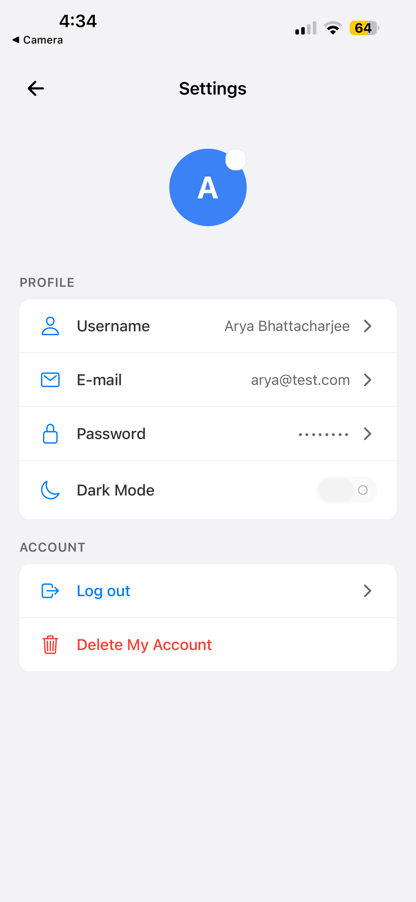 | 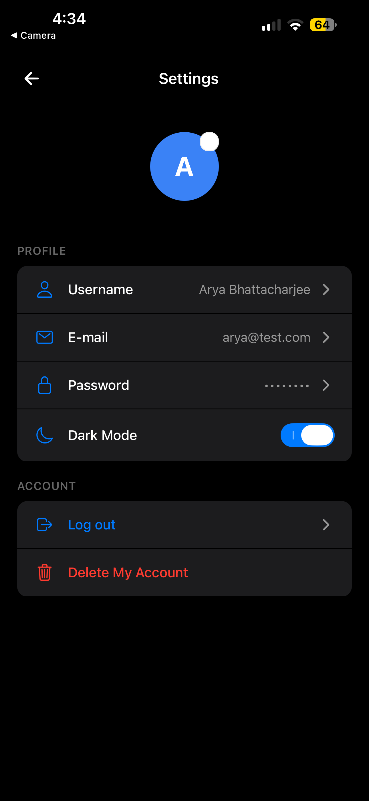 |

---

## 🛠 Tech Stack

- **Framework**: React Native (Expo)
- **Navigation**: Expo Router
- **State Management**: React Context API
- **Styling**: StyleSheet with Custom Design System
- **Animations**: React Native Reanimated
- **Storage**: Expo Secure Store
- **Networking**: Axios

---

## 🚀 Get Started

1.  **Install dependencies**:
    ```bash
    npm install
    ```

2.  **Start the app**:
    ```bash
    npx expo start
    ```

3.  **Run on device**:
    - Press `i` for iOS Simulator.
    - Press `a` for Android Emulator.
    - Scan the QR code with Expo Go.
